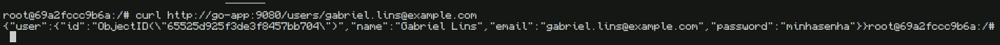

<h1>Curso de DevOps 2023.2 - IT Talent</h1>

<h2>Desafio Prático - Clone do Hackathon</h2>

**Discente**: Gabriel Lins

---

<h2>Índice</h2>

- [Descrição da Atividade](#descrição-da-atividade)
- [Comandos utilizados](#comandos-utilizados)
  - [Buildar a imagem](#buildar-a-imagem)
  - [Executando o container no host](#executando-o-container-no-host)
  - [Adicionando uma tag à imagem](#adicionando-uma-tag-à-imagem)
  - [Enviando a imagem para o Docker Hub](#enviando-a-imagem-para-o-docker-hub)
  - [Executando containers com Docker Compose](#executando-containers-com-docker-compose)
  - [Entrando no container e instalando os pacotes](#entrando-no-container-e-instalando-os-pacotes)
  - [Aplicando o CRUD com curl](#aplicando-o-crud-com-curl)
    - [Create (POST)](#create-post)
    - [Read (GET)](#read-get)
    - [Update (PUT)](#update-put)
    - [Delete (DELETE)](#delete-delete)
- [Screenshots](#screenshots)
  - [Buildando a imagem](#buildando-a-imagem)
  - [Executando o container localmente (teste)](#executando-o-container-localmente-teste)
  - [Subindo a imagem para o Docker Hub](#subindo-a-imagem-para-o-docker-hub)
  - [Executando tudo com o Docker Compose](#executando-tudo-com-o-docker-compose)
  - [Instalação dos pacotes no container cliente](#instalação-dos-pacotes-no-container-cliente)
  - [Criação do usuário (POST)](#criação-do-usuário-post)
  - [Leitura do usuário (GET)](#leitura-do-usuário-get)
  - [Atualização do usuário (PUT)](#atualização-do-usuário-put)
  - [Deleção do usuário (DELETE)](#deleção-do-usuário-delete)

---

## Descrição da Atividade

1. Clonar o seguinte repositório: http://github.com/ittalent2023-2/go-mongo-crud-rest-api
 
2. Criar o arquivo Dockerfile para essa aplicação GO. Sugerimos essa documentação como referência: https://docs.docker.com/language/golang/build-images/

3. Fazer o build e fazer o push dessa imagem para o Docker Hub. o Criar um arquivo docker-compose.yml, e fazer a orquestração do deploy do banco Mongodb(banco de dados), da aplicação Go (servidor), e de uma instância Linux(cliente), criando assim 3 containers, observando as seguintes recomendações:

  &emsp;3.1. Criar uma network específica de forma que as instâncias se comuniquem entre si;

  &emsp;3.2. Fazer o mapeamento do volume gerenciado pelo Docker do MongoDB;

  &emsp;3.3. Na instancia linux (cliente) instalar os pacotes curl, vim, htop;

  &emsp;3.4. Criar uma dependência entre os serviços para que o banco suba antes da aplicação;

4. Com a aplicação rodando, executar os métodos de interação GET, POST, PUT e DELETE com a aplicação a partir da instancia Linux(cliente)

5. Tirar print dos resultados

6. A avaliação será feita pelos commits no github, você deve responder com o link para o repo

---

## Comandos utilizados

### Buildar a imagem

```shell
docker build -t ittalent-clone-hackathon/go-app:latest ./go-mongo-crud-rest-api/
```

### Executando o container no host

Testamos a execução do container na máquina host só para garantir o correto funcionamento antes de fazer push na imagem

```shell
docker run -p 9080:9080 -e MONGO_DB_HOST=mongodb ittalent-clone-hackathon/go-app
```

### Adicionando uma tag à imagem

```shell
docker tag ittalent-clone-hackathon/go-app:latest gabriel3035/ittalent-clone-hackathon:1.0
```

### Enviando a imagem para o Docker Hub

```shell
docker push gabriel3035/ittalent-clone-hackathon:latest
```

### Executando containers com Docker Compose

```shell
docker compose up -d
```

### Entrando no container e instalando os pacotes

```
docker exec -it linux-client bash
apt update && apt install -y curl vim htop
```

### Aplicando o CRUD com curl

#### Create (POST)

```shell
curl -X POST -H "Content-Type: application/json" -d '{"name": "Gabriel Lins", "email": "gabriel.lins@example.com", "password": "minhasenha"}' http://go-app:9080/users
```

#### Read (GET)

```shell
curl http://go-app:9080/users/gabriel.lins@example.com
```

#### Update (PUT)

```shell
curl -X PUT -H "Content-Type: application/json" -d '{"name": "Updated Gabriel Lins", "email": "gabriel.lins@example.com", "password": "novasenha"}' http://go-app:9080/users/gabriel.lins@example.com
```

#### Delete (DELETE)

```shell
DELETE http://go-app:9080/users/gabriel.lins@example.com
```

---

## Screenshots

### Buildando a imagem


### Executando o container localmente (teste)


### Subindo a imagem para o Docker Hub


### Executando tudo com o Docker Compose


### Instalação dos pacotes no container cliente


### Criação do usuário (POST)


### Leitura do usuário (GET)



### Atualização do usuário (PUT)


### Deleção do usuário (DELETE)


